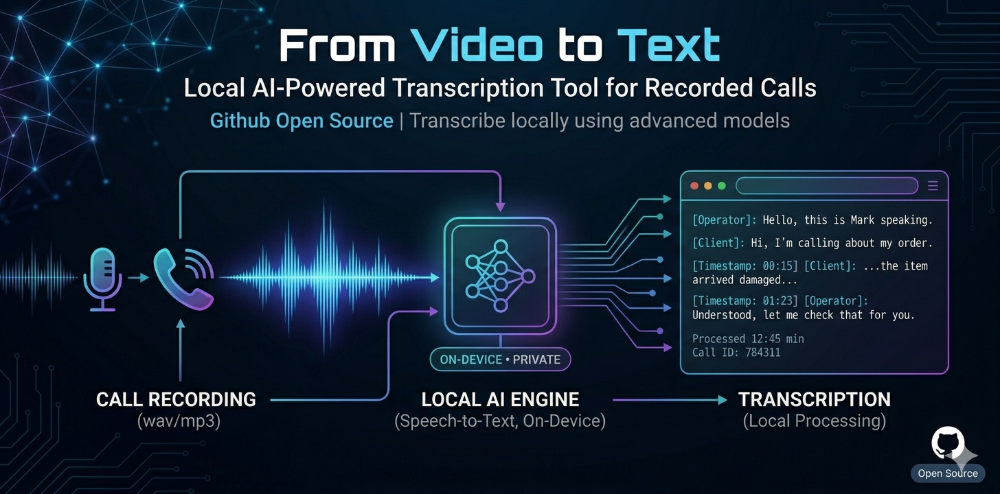

# 🎬 From Video to Text - on your PC

## Il problema

Hai ore di registrazioni di chiamate, riunioni, lezioni da recuperare e sintetizzare — ma non hai il tempo di riascoltarle una per una e dovresti fare altro di prioritario.

Non parliamo di video online come YouTube: per quelli esistono già tantissimi tool in grado di trascrivere e creare chatbot interrogabili sulle fonti.

Parliamo di **registrazioni video e audio in locale**, sul tuo device. File che restano nei tuoi hard disk, nei NAS aziendali, nelle cartelle condivise. Come trasformare GB di video in **testo ricercabile e utilizzabile** dai tuoi strumenti AI — aziendali e non?

## La soluzione

Ho creato un processo **interamente in locale**, open source, che estrae e trascrive il contenuto audio di qualsiasi registrazione video — senza inviare nulla al cloud, senza abbonamenti, senza limiti di utilizzo.

Un'applicazione desktop con interfaccia grafica moderna che **estrae l'audio**, lo **segmenta** in parti di dimensione configurabile e lo **trascrive automaticamente** usando modelli Whisper. Supporta **italiano** e **inglese** con rilevamento automatico della lingua. Funziona su **CPU** o **GPU NVIDIA** (con accelerazione CUDA), con fallback automatico su CPU se CUDA non è disponibile.


---

## ✨ Funzionalità

- **Estrazione + segmentazione audio** da qualsiasi formato video (MP4, AVI, MKV, MOV, ecc.) con dimensione segmenti configurabile
- **Trascrizione locale** con [faster-whisper](https://github.com/SYSTRAN/faster-whisper) — modello consigliato `large-v3-turbo`, accurato su italiano e inglese
- **Accelerazione GPU NVIDIA** opzionale: rilevamento automatico delle DLL CUDA installate via pip (cuBLAS, cuDNN); selezione `cuda`, `cpu` o `auto` direttamente dalla GUI
- **Fallback automatico CUDA → CPU** se la GPU non è disponibile o le librerie CUDA non sono caricabili — l'app non si blocca, segnala l'errore nel log e prosegue su CPU
- **Pipeline one-click**: un unico pulsante esegue splitting + trascrizione in sequenza senza intervento manuale
- **Cleanup deterministico delle risorse GPU** a fine trascrizione (svuotamento esplicito della cache CUDA): l'app resta aperta dopo il completamento e ti permette di consultare con calma le metriche finali
- **Pulizia automatica**: i file audio segmentati vengono eliminati al termine della trascrizione completata con successo
- **Checkpoint/resume**: il progresso viene salvato in `_progresso.json` dopo ogni segmento — se il processo viene interrotto, alla ripresa parte dal punto in cui si era fermato
- **Pausa e Stop durante l'esecuzione**: pulsanti ⏸ e ⏹ accessibili dal log; allo stop viene generato comunque il file di trascrizione parziale con quanto elaborato fino a quel momento
- **Filtro VAD** integrato contro le allucinazioni nei silenzi
- **Output flessibile**: testo semplice o dettagliato con timestamp, con report completo delle metriche
- **Interfaccia moderna** con CustomTkinter (dark/light) + modalità CLI standalone (`transcriber.py`)

---

## 📋 Prerequisiti

### 1. Python 3.8 o superiore

Verifica se Python è già installato aprendo un terminale:

```bash
python --version
```

Se non è installato:

- **Windows**: scarica da [python.org/downloads](https://www.python.org/downloads/). Durante l'installazione **spunta "Add Python to PATH"**.
- **macOS**: `brew install python` oppure scarica da [python.org](https://www.python.org/downloads/)
- **Linux (Ubuntu/Debian)**: `sudo apt update && sudo apt install python3 python3-pip python3-venv`

### 2. FFmpeg

FFmpeg è necessario per estrarre e segmentare l'audio dai video. Verifica se è installato:

```bash
ffmpeg -version
```

Se non è installato:

<details>
<summary><b>🪟 Windows</b></summary>

**Opzione A — winget (consigliata, Windows 10/11):**
```bash
winget install FFmpeg
```
Riavvia il terminale dopo l'installazione.

**Opzione B — Installazione manuale:**
1. Vai su [gyan.dev/ffmpeg/builds](https://www.gyan.dev/ffmpeg/builds/) e scarica `ffmpeg-release-essentials.zip`
2. Estrai lo ZIP in una cartella, es. `C:\ffmpeg`
3. Aggiungi `C:\ffmpeg\bin` al PATH di sistema:
   - Cerca "Variabili d'ambiente" nel menu Start
   - Modifica la variabile `Path` → Aggiungi `C:\ffmpeg\bin`
4. Riavvia il terminale e verifica con `ffmpeg -version`
</details>

<details>
<summary><b>🍎 macOS</b></summary>

```bash
brew install ffmpeg
```
Se non hai Homebrew: [brew.sh](https://brew.sh/)
</details>

<details>
<summary><b>🐧 Linux (Ubuntu/Debian)</b></summary>

```bash
sudo apt update
sudo apt install ffmpeg
```
</details>

### 3. Git (per clonare il repository)

```bash
git --version
```

Se non è installato:
- **Windows**: scarica da [git-scm.com](https://git-scm.com/)
- **macOS**: `brew install git` oppure `xcode-select --install`
- **Linux**: `sudo apt install git`

---

## 🚀 Installazione del progetto

### Installazione base (CPU)

```bash
# 1. Clona il repository
git clone https://github.com/PierpaoloPalmiotti/from_video_to_transcript.git
cd from_video_to_transcript

# 2. Crea un virtual environment (consigliato)
python -m venv venv

# 3. Attiva il virtual environment
# Windows:
venv\Scripts\activate
# macOS/Linux:
source venv/bin/activate

# 4. Installa le dipendenze base
pip install -r requirements.txt
```

### Installazione opzionale per GPU NVIDIA

Se hai una GPU NVIDIA e vuoi sfruttare l'accelerazione CUDA (5-8x più veloce della CPU su modelli grandi), installa anche le librerie cuBLAS e cuDNN. Sono pacchetti pesanti (~700 MB), quindi alza il timeout di pip:

```bash
pip install --timeout 300 -r requirements-gpu.txt
```

> 💡 Non serve installare manualmente CUDA Toolkit o NVIDIA Driver Pack: i pacchetti `nvidia-cublas-cu12` e `nvidia-cudnn-cu12` contengono le DLL già pronte. L'app le rileva automaticamente e le aggiunge al `PATH` al primo avvio.
>
> ⚠️ **Driver NVIDIA**: assicurati comunque di avere i driver NVIDIA aggiornati installati a livello di sistema (i pacchetti pip portano solo le librerie utente, non il driver kernel-mode).

### ⚠️ Nota sul primo avvio

Al primo avvio della trascrizione, il modello Whisper scelto verrà **scaricato automaticamente** da Hugging Face. Le dimensioni variano in base al modello:

| Modello | Download |
|---|---|
| `tiny` | ~75 MB |
| `small` | ~460 MB |
| `medium` | ~1.5 GB |
| `large-v3-turbo` | ~1.6 GB |
| `large-v3` | ~3 GB |

Il download avviene una sola volta — **la connessione internet è necessaria solo per questo passaggio**. Tutte le esecuzioni successive funzionano completamente offline.

Se preferisci scaricare il modello in anticipo (ad esempio quando hai una buona connessione), puoi farlo da terminale:

```bash
# Pre-download del modello consigliato
huggingface-cli download Systran/faster-whisper-large-v3-turbo

# Oppure di un altro modello
huggingface-cli download Systran/faster-whisper-medium
```

---

## 📂 Struttura del progetto

```
from_video_to_transcript/
│
├── main.py                  # Applicazione GUI (CustomTkinter)
├── transcriber.py           # Modulo CLI standalone per trascrizione
├── requirements.txt         # Dipendenze base (CPU)
├── requirements-gpu.txt     # Dipendenze opzionali per GPU NVIDIA
├── README.md                # Documentazione
├── LICENSE                  # Licenza MIT
├── .gitignore               # File e cartelle esclusi da Git
│
├── ffmpeg.exe               # ⚠️ Solo Windows, opzionale (vedi nota sotto)
│
└── venv/                    # Virtual environment (generato, non versionato)
```

> ⚠️ **ffmpeg.exe**: su Windows puoi copiare `ffmpeg.exe` direttamente nella cartella del progetto come alternativa all'installazione globale nel PATH. Su macOS e Linux, FFmpeg va installato a livello di sistema (vedi [Prerequisiti](#-prerequisiti)). Il file è escluso dal repository tramite `.gitignore`.

> 💡 **venv/** e i modelli Whisper (salvati in `~/.cache/huggingface/`) non sono inclusi nel repository. Vengono generati localmente durante l'installazione e il primo avvio.

### Output generato a runtime

Quando elabori un video, l'applicazione crea una cartella dedicata accanto al file sorgente:

```
cartella_video/
├── intervista.mp4
└── intervista/                               # Cartella output (nome = nome video)
    ├── intervista_segmento_1.wav             # Eliminati automaticamente dopo
    ├── intervista_segmento_2.wav             # la trascrizione completata
    ├── intervista_segmento_3.wav             #
    ├── intervista_trascrizione.txt           # Output finale
    └── _progresso.json                       # Checkpoint (rimosso a completamento)
```

> 💡 I file audio segmentati vengono **eliminati automaticamente** al termine di una trascrizione completata con successo. In caso di interruzione, i file restano e `_progresso.json` tiene traccia di quanto già trascritto per permettere la ripresa.

---

## 💻 Utilizzo

### Interfaccia grafica (GUI)

```bash
python main.py
```

1. Clicca **📁 Sfoglia** e seleziona un video
2. Imposta la dimensione massima per segmento (in MB)
3. Scegli una delle due modalità:
   - **▶ Elabora Video** — esegue solo lo splitting audio
   - **⚡ Elabora + Trascrivi** — esegue splitting e trascrizione in sequenza con un solo click
4. Se hai usato solo **Elabora Video**, clicca **🎙 Trascrivi Segmenti** per avviare la trascrizione manualmente
5. Imposta **Device** su `auto` (default), `cpu` o `cuda` in base alla tua macchina
6. La trascrizione viene salvata come `{nome_video}_trascrizione.txt` nella cartella del video

Durante splitting e trascrizione compaiono i pulsanti **⏸ Pausa** e **⏹ Stop** nel pannello log. Allo stop viene generato comunque il file di trascrizione con quanto elaborato fino a quel momento — potrai riprendere in seguito dallo stesso punto.

A fine trascrizione vedrai nel log:

```
🧹 Risorse modello liberate
📋 REPORT FINALE END-TO-END
   ...
🟢 App pronta — puoi consultare i log o avviare un'altra trascrizione.
```

Il messaggio finale conferma che la cache GPU è stata svuotata correttamente e che l'app è pronta per un nuovo lavoro.

Puoi anche usare **📂 Trascrivi da Cartella...** per trascrivere file audio già esistenti senza passare dallo splitting.

### Riga di comando (CLI)

```bash
# Trascrivi una cartella di file audio
python transcriber.py /percorso/cartella_audio/

# Forza italiano e formato dettagliato con timestamp
python transcriber.py /percorso/cartella_audio/ --lingua it --formato dettagliato

# Usa la GPU
python transcriber.py /percorso/cartella_audio/ --device cuda

# Usa un modello più leggero se la RAM scarseggia
python transcriber.py /percorso/cartella_audio/ --modello medium

# Specifica un file di output personalizzato
python transcriber.py /percorso/cartella_audio/ --output risultato.txt
```

**Opzioni CLI disponibili:**

| Opzione | Default | Descrizione |
|---|---|---|
| `--modello` | `large-v3-turbo` | Modello Whisper da usare |
| `--lingua` | auto-detect | Codice lingua (`it`, `en`, ecc.) |
| `--device` | `auto` | `cpu`, `cuda` o `auto` |
| `--beam-size` | `5` | Beam search size (1 = veloce, 5 = accurato) |
| `--formato` | `txt` | `txt` o `dettagliato` |
| `--output` | `trascrizione.txt` | Percorso file di output |
| `--no-vad` | disattivato | Disabilita il filtro anti-allucinazioni |

---

## 📁 Struttura output

Ogni video genera una cartella dedicata con il proprio nome:

```
cartella_video/
├── intervista.mp4
├── intervista/
│   └── intervista_trascrizione.txt
├── riunione.mp4
└── riunione/
    └── riunione_trascrizione.txt
```

---

## ⚡ Performance reali e proiezioni

### Benchmark misurato

Dai test effettuati con `large-v3-turbo` in quantizzazione `int8` su CPU, il tempo end-to-end (splitting + trascrizione) è di circa:

> **~20 sec/MB** di video sorgente

Questo valore include il caricamento del modello, l'estrazione audio, la segmentazione e la trascrizione completa.

### Rapporti di velocità stimati per modello (CPU, int8)

| Modello | sec/MB stimati | Rapporto vs turbo |
|---|---|---|
| `tiny` | ~3 | ~7x più veloce |
| `small` | ~7 | ~3x più veloce |
| `medium` | ~14 | ~1.4x più veloce |
| `large-v3-turbo` | **~20** | **baseline (misurato)** |
| `large-v3` | ~50 | ~2.5x più lento |

### Proiezioni tempi E2E per dimensione video e modello

| Dimensione video | `tiny` (~3 s/MB) | `small` (~7 s/MB) | `medium` (~14 s/MB) | `large-v3-turbo` (~20 s/MB) ⭐ | `large-v3` (~50 s/MB) |
|---|---|---|---|---|---|
| **50 MB** | ~2 min | ~6 min | ~12 min | **~17 min** | ~42 min |
| **100 MB** | ~5 min | ~12 min | ~23 min | **~33 min** | ~1h 23min |
| **200 MB** | ~10 min | ~23 min | ~47 min | **~1h 7min** | ~2h 47min |
| **500 MB** | ~25 min | ~58 min | ~1h 57min | **~2h 47min** | ~6h 57min |
| **1 GB** | ~51 min | ~2h | ~3h 59min | **~5h 41min** | ~14h 13min |
| **2 GB** | ~1h 42min | ~3h 59min | ~7h 57min | **~11h 22min** | ~28h 26min |
| **5 GB** | ~4h 16min | ~9h 58min | ~19h 53min | **~28h 24min** | ~71h (≈3 giorni) |

> ⭐ La colonna `large-v3-turbo` è basata su benchmark reali. Le altre sono **proiezioni stimate** in base ai rapporti di velocità tipici tra modelli su CPU int8. I tempi effettivi possono variare in base a CPU, RAM e complessità dell'audio.

> ⚠️ **Nota qualità**: `tiny` e `small` sono molto più veloci ma la qualità in italiano degrada significativamente. `medium` è un buon compromesso se la RAM è limitata. `large-v3` offre qualità identica al turbo ma impiega 2.5x più tempo — **il turbo resta la scelta migliore** in quasi tutti gli scenari.

> 💡 **Consiglio**: per video superiori a 500 MB con `large-v3-turbo` o `large-v3`, una GPU dedicata (o un Mac con chip Pro/Max) fa una differenza enorme. Con una **GPU NVIDIA** (RTX 3060+) i tempi di trascrizione si riducono di **5-8x**. Se lavori solo su CPU, puoi lanciare la trascrizione di notte su file grandi.

### Confronto CPU vs GPU vs Apple Silicon

| Setup | sec/MB | 200 MB | 1 GB |
|---|---|---|---|
| CPU (i7/Ryzen 7, int8) | ~20 | ~1h 7min | ~5h 41min |
| CPU (i9/Ryzen 9, int8) | ~14 | ~47 min | ~4h |
| MacBook Air M2/M3 (int8) | ~16 | ~53 min | ~4h 33min |
| MacBook Pro M2 Pro/M3 Pro (int8) | ~12 | ~40 min | ~3h 25min |
| MacBook Pro M3 Max/M4 Pro (int8) | ~9 | ~30 min | ~2h 34min |
| GPU (RTX 3060, float16) | ~4 | ~13 min | ~1h 8min |
| GPU (RTX 4090, float16) | ~2 | ~7 min | ~34 min |

> 💡 **Nota su macOS**: faster-whisper su Apple Silicon gira su CPU (non sfrutta Metal/GPU nativamente), ma le performance dei chip M-series sono eccellenti grazie alla bandwidth di memoria unificata e all'efficienza dei core. Un MacBook Pro M3 Pro si colloca a metà tra un i9 desktop e una RTX 3060. Per sfruttare appieno la GPU Apple, valuta alternative come [MLX Whisper](https://github.com/ml-explore/mlx-examples/tree/main/whisper) che supportano l'accelerazione Metal nativa.

---

## 🛠 Scelta del modello

| Modello | RAM (int8) | VRAM (float16) | Velocità | Qualità IT/EN |
|---|---|---|---|---|
| `tiny` | ~0.5 GB | ~1 GB | ⚡⚡⚡⚡⚡ | ⭐⭐ |
| `small` | ~1 GB | ~2 GB | ⚡⚡⚡⚡ | ⭐⭐⭐ |
| `medium` | ~2 GB | ~4 GB | ⚡⚡⚡ | ⭐⭐⭐⭐ |
| `large-v3-turbo` | ~2.5 GB | ~5 GB | ⚡⚡⚡ | ⭐⭐⭐⭐⭐ |
| `large-v3` | ~4 GB | ~8 GB | ⚡ | ⭐⭐⭐⭐⭐ |

> **Consiglio**: usa `large-v3-turbo` come default. Scala a `medium` se la RAM/VRAM non basta. Evita `tiny` e `base` per l'italiano.

---

## 🔧 Troubleshooting

| Problema | Soluzione |
|---|---|
| `FFmpeg non trovato` | Verifica che `ffmpeg -version` funzioni nel terminale. Se no, reinstallalo e riavvia il terminale. |
| `faster-whisper non installato` | Esegui `pip install faster-whisper` con il virtual environment attivo |
| Trascrizione lenta su CPU | Prova un modello più piccolo (`medium`, `small`) oppure passa a GPU con `--device cuda` (vedi sotto) |
| Il modello non si scarica | Verifica la connessione internet. La cache è in `~/.cache/huggingface/` |
| `Could not load library cudnn_ops_infer64_8.dll` o `cublas64_12.dll` non trovata | Installa le librerie GPU: `pip install --timeout 300 -r requirements-gpu.txt`. L'app rileva automaticamente i percorsi DLL e li aggiunge al PATH. |
| `CUDA out of memory` o errori CUDA generici | Scegli un modello più piccolo (es. `medium` invece di `large-v3-turbo`). Se la VRAM è scarsa (<5 GB), passa a `cpu`. L'app fa comunque **fallback automatico su CPU** se CUDA fallisce al caricamento del modello. |
| Driver NVIDIA mancanti | Anche con i pacchetti pip installati, serve il driver NVIDIA a livello di sistema. Aggiornalo da [nvidia.com/Download](https://www.nvidia.com/Download/index.aspx). |
| Pip si blocca su `nvidia-cublas-cu12` (timeout) | Sono pacchetti grandi (~500 MB ciascuno). Alza il timeout: `pip install --timeout 300 -r requirements-gpu.txt` |
| L'app si chiudeva dopo la trascrizione GPU | Risolto: ora c'è un cleanup deterministico della cache CUDA prima del messagebox finale, l'app resta aperta. |
| Allucinazioni nel testo | Il filtro VAD è attivo di default. Se persistono, prova `--lingua it` per forzare la lingua |
| La trascrizione non riprende dal punto giusto | Verifica che `_progresso.json` sia presente nella cartella dei segmenti. Se corrotto, eliminalo per ripartire da zero |

---

## 📄 Licenza

Questo progetto è distribuito sotto licenza [MIT](LICENSE).